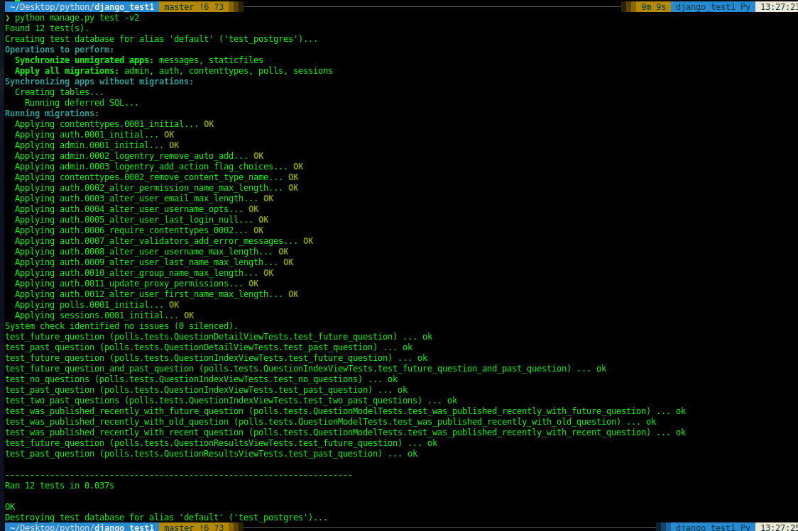

# Overview
This Django project is just an implementation of the Django tutorial https://docs.djangoproject.com/en/4.1/intro/

**GOAL**: Improve my knowledge of Django, and experiment with Python 3.11 and Django 4.1.1

**Additional Goal**: Experiment with async functionality in Django

# Key Dependencies
* Python 3.11
* Django 4.1.4
* psycopg2 2.9.3
* Gunicorn 20.1.0
* Uvicorn 0.20.0

# Running Locally
You will need to create a `.my_pgpass` file with the following:
```text
localhost:5432:<your-database-name>:<insert-user-here>:<insert-password-here>
```

You will need to generate a secret - which is handle via an environment variable.
Reference: https://stackoverflow.com/a/64213581
We use the python-decouple library.


# Testing

`python manage.py test -v2`


## Test Data
Custom Django management command to create data for testing.
`python manage.py setup_test_data`

* Guide I followed for this project:  https://mattsegal.dev/django-factoryboy-dummy-data.html
* FactoryBoy: https://factoryboy.readthedocs.io/en/latest/reference.html
  * https://github.com/FactoryBoy/factory_boy
* Faker: https://faker.readthedocs.io/en/latest/fakerclass.html